# IntroJaxRs - Guide Pédagogique complet

## 📚 Table des matières

1. [Introduction à JAX-RS](#introduction-à-jax-rs)
2. [Architecture du projet](#architecture-du-projet)
3. [Flux général de l'application](#flux-général-de-lapplication)
4. [Les concepts clés](#les-concepts-clés)
5. [Guide pratique des endpoints](#guide-pratique-des-endpoints)
6. [Système d'authentification et d'autorisation](#système-dauthentication-et-dautorisation)
7. [Gestion des commandes](#gestion-des-commandes)
8. [Installation et exécution](#installation-et-exécution)

---

## 🎯 Introduction à JAX-RS

### Qu'est-ce que JAX-RS ?

**JAX-RS** (Java API for RESTful Web Services) est une spécification Java qui permet de créer facilement des **API REST**. Elle fournit des annotations pour transformer une classe Java en ressource web accessible via HTTP.

### Concept-clé : REST

REST signifie **Representational State Transfer**. C'est un style architectural basé sur :

| Concept | Description |
|---------|-------------|
| **Ressources** | Les données gérées par votre API (produits, commandes, utilisateurs) |
| **URLs** | Identifient les ressources (`/api/product`, `/api/order/123`) |
| **Méthodes HTTP** | Opérations sur les ressources (GET, POST, PATCH, DELETE) |
| **Représentation** | Format des données échangées (JSON, XML) |

### Analogie simple

```
REST est comme un restaurant :
- GET    = demander le menu
- POST   = commander un plat
- PATCH  = modifier votre commande
- DELETE = annuler votre commande
```

---

## 🏗️ Architecture du projet

### Structure en couches

```
┌─────────────────────────────────────────────┐
│   PRESENTATION LAYER (API REST)             │
│   Resources (Endpoints JAX-RS)              │
├─────────────────────────────────────────────┤
│   SERVICE LAYER (Logique métier)            │
│   Services d'authentification et commandes  │
├─────────────────────────────────────────────┤
│   PERSISTENCE LAYER (Accès aux données)     │
│   DAOs et Entités JPA Hibernate             │
├─────────────────────────────────────────────┤
│   DATABASE                                  │
│   Données persistantes                      │
└─────────────────────────────────────────────┘
```

### Composants principaux

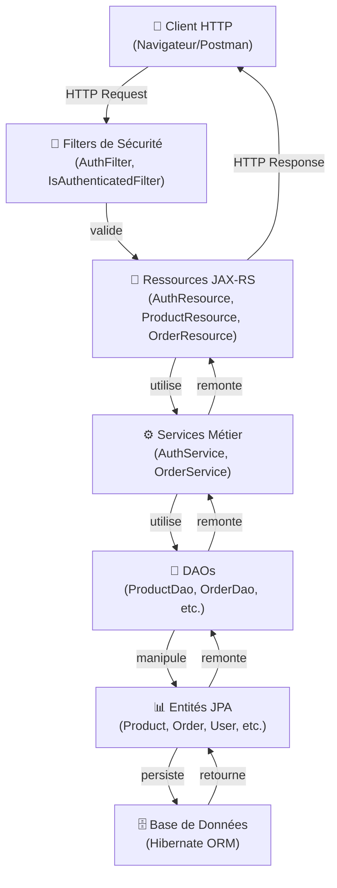

---

## 🔄 Flux général de l'application

### 1. Cycle de vie d'une requête HTTP

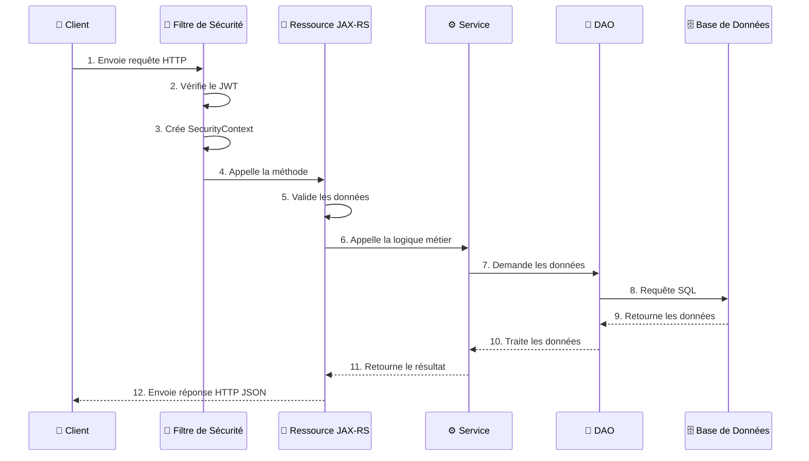

### 2. Flux d'authentification

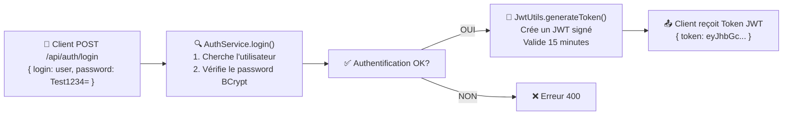

### 3. Flux d'utilisation des tokens

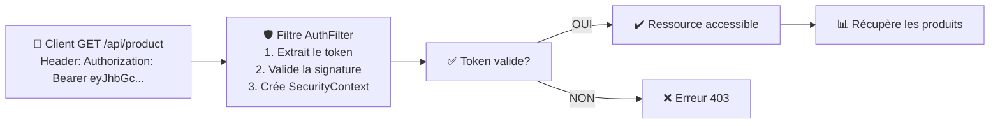

### 4. Flux complet d'une commande

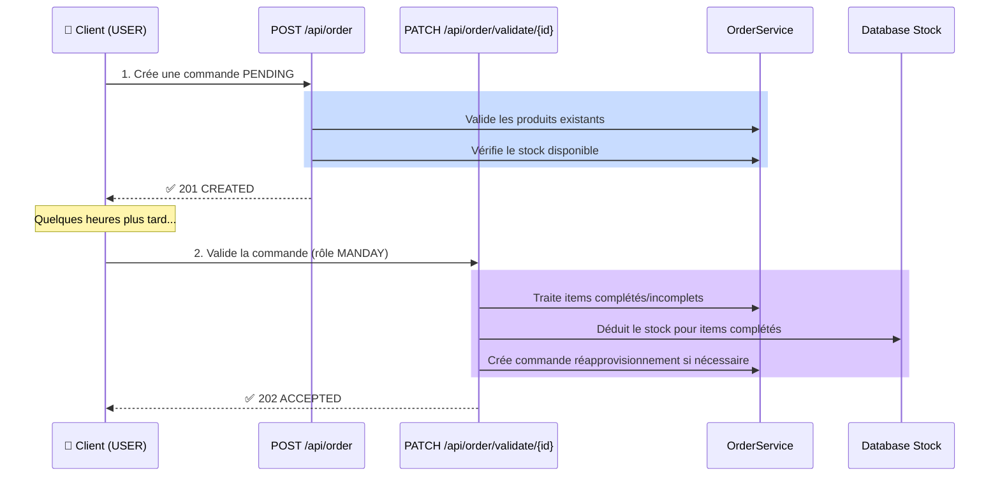

---

## 💡 Les concepts clés

### Annotations JAX-RS principales

#### 1. `@Path` - Définit l'URL de la ressource

```java
@Path("/product")  // Cette classe sera accessible à /api/product
public class ProductResource {
    
    @Path("{id}")   // Paramètre d'URL : /api/product/{id}
    public Response getById(@PathParam("id") UUID id) { }
}
```

#### 2. `@GET`, `@POST`, `@PATCH`, `@DELETE` - Méthodes HTTP

```java
@GET                    // Lire des données (sans effet secondaire)
@POST                   // Créer une nouvelle ressource
@PATCH                  // Modifier une ressource existante
@DELETE                 // Supprimer une ressource
@PUT                    // Remplacer entièrement une ressource
```

#### 3. `@Produces` et `@Consumes` - Format des données

```java
@Produces(MediaType.APPLICATION_JSON)   // La réponse sera en JSON
@Consumes(MediaType.APPLICATION_JSON)   // La requête doit être en JSON
public Response create(@Valid OrderRequest request) { }
```

#### 4. `@PathParam`, `@QueryParam`, `@HeaderParam` - Paramètres

```java
@GET
@Path("/{id}")
public Response getById(
    @PathParam("id") UUID id,              // Dans l'URL : /product/123
    @QueryParam("category") String cat,    // Dans la query : ?category=electronics
    @HeaderParam("Authorization") String token  // Dans les headers
) { }
```

### Cycle de vie d'une annotation personnalisée

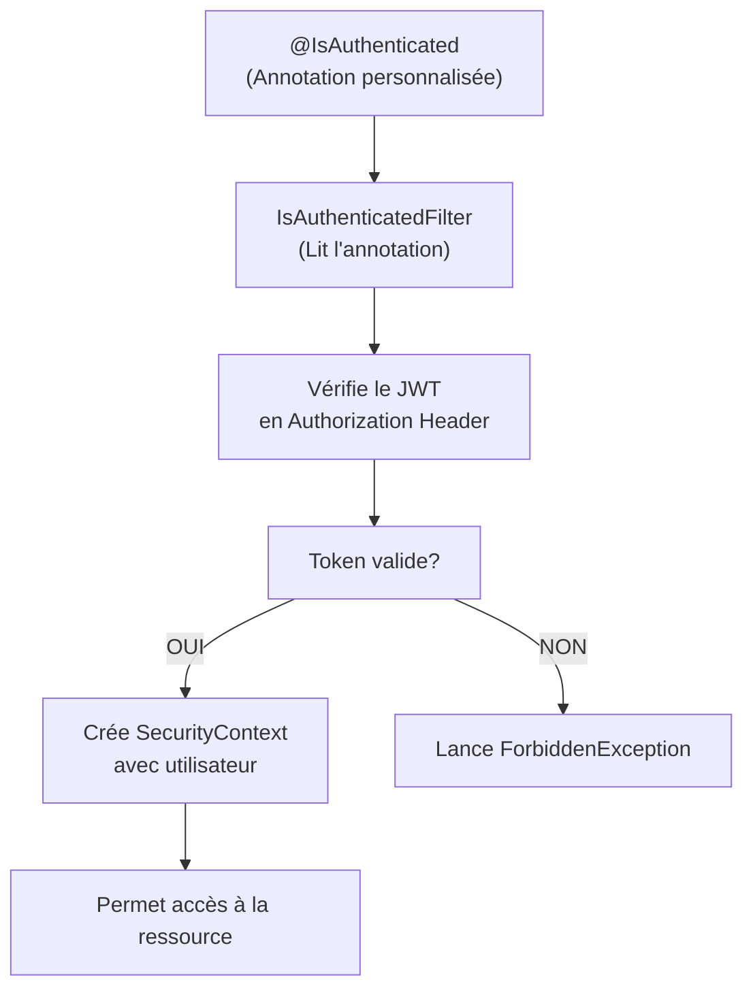

---

## 🔌 Guide pratique des endpoints

### 🔓 Endpoint Authentification (Public)

#### Enregistrement

```http
POST /api/auth/register
Content-Type: application/json

{
  "email": "john@example.com",
  "username": "john",
  "password": "SecurePass123="
}
```

**Réponse 200 OK**
```json
{}
```

#### Connexion

```http
POST /api/auth/login
Content-Type: application/json

{
  "login": "john",           // email ou username
  "password": "SecurePass123="
}
```

**Réponse 200 OK**
```json
{
  "user": {
    "id": 1,
    "username": "john",
    "email": "john@example.com",
    "roles": ["USER"]
  },
  "token": "eyJhbGciOiJIUzI1NiJ9.eyJzdWIiOiJqb2huIi4uLiJ9.signature"
}
```

### 📦 Endpoint Produits (Public)

#### Lister les produits

```http
GET /api/product
```

**Réponse 200 OK**
```json
[
  {
    "id": "550e8400-e29b-41d4-a716-446655440000",
    "name": "iPhone 15 Pro",
    "brand": "Apple",
    "price": 129999,
    "category": "Électronique"
  },
  ...
]
```

#### Détails d'un produit

```http
GET /api/product/{id}
```

**Réponse 200 OK**
```json
{
  "id": "550e8400-e29b-41d4-a716-446655440000",
  "name": "iPhone 15 Pro",
  "description": "Smartphone haut de gamme Apple",
  "brand": "Apple",
  "price": 129999,
  "category": "Électronique",
  "stock": {
    "quantity": 45,
    "threshold": 10,
    "orderQuantity": 50
  }
}
```

### 🛍️ Endpoint Commandes (Sécurisé)

#### Crée une commande (Rôle: USER)

```http
POST /api/order
Authorization: Bearer {token}
Content-Type: application/json

{
  "orderLines": [
    {
      "productId": "550e8400-e29b-41d4-a716-446655440000",
      "quantity": 2
    },
    {
      "productId": "660e8400-e29b-41d4-a716-446655440111",
      "quantity": 1
    }
  ]
}
```

**Réponse 201 CREATED**

#### Valide une commande (Rôle: MANDAY)

```http
PATCH /api/order/validate/{id}
Authorization: Bearer {token}
Content-Type: application/json

{
  "complete": {
    "orderLines": [
      {
        "productId": "550e8400-e29b-41d4-a716-446655440000",
        "quantity": 1
      }
    ]
  },
  "incomplete": {
    "orderLines": [
      {
        "productId": "660e8400-e29b-41d4-a716-446655440111",
        "quantity": 1
      }
    ]
  }
}
```

**Réponse 202 ACCEPTED**

---

## 🔐 Système d'authentification et d'autorisation

### Architecture de sécurité

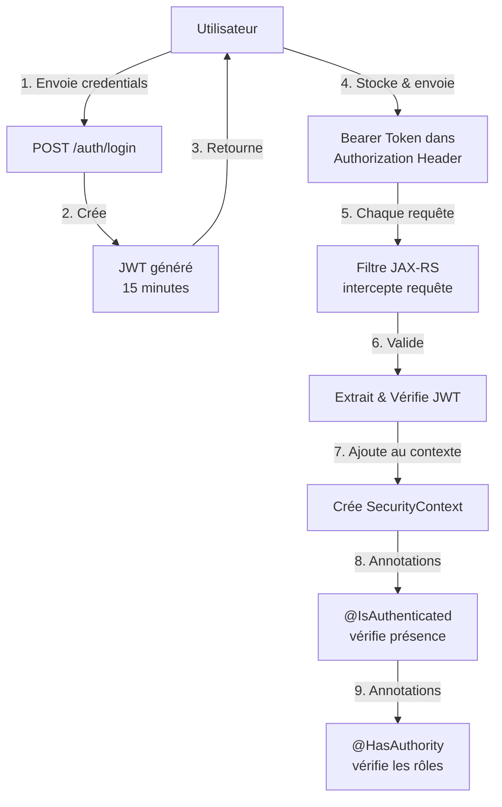

### Types d'authentification

| Annotation | Rôle | Exemple d'utilisation |
|-----------|------|----------------------|
| `@IsAnonymous` | Aucune authentification requise | `/auth/login`, `/auth/register` |
| `@IsAuthenticated` | Utilisateur doit être connecté | `/hello` |
| `@HasAuthority(roles="USER")` | Utilisateur doit avoir un rôle spécifique | Créer une commande |
| `@HasAuthority(roles="MANDAY")` | Responsable de validation | Valider une commande |

### Cycle de traitement du JWT

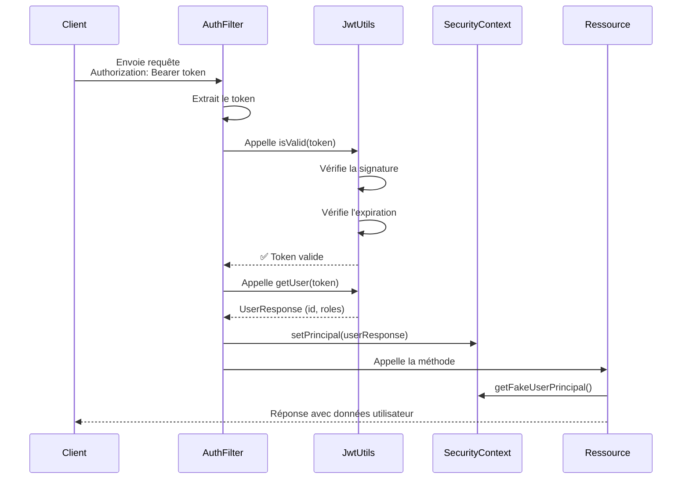

---

## 🛒 Gestion des commandes

### États possibles d'une commande

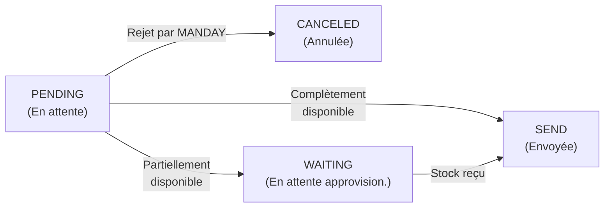

### Cas d'utilisation : Commande partielle

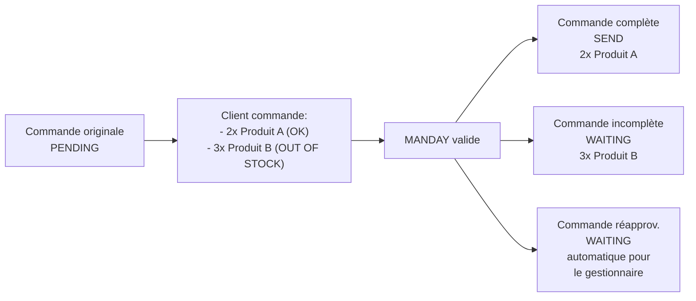

### Flux complet du stock management

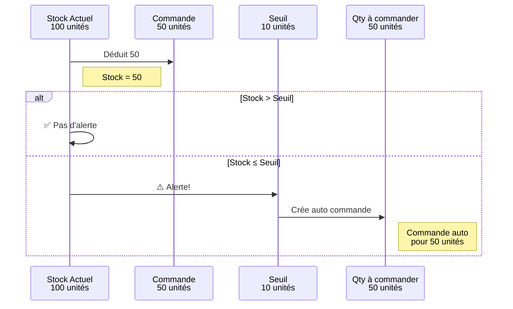

---

## 🚀 Installation et exécution

### Prérequis

```bash
Java 17+
Maven 3.8+
```

### Configuration de la base de données

Le projet utilise Hibernate avec une base de données H2 (en mémoire par défaut).

Configuration dans `persistence.xml` :

```xml
<persistence-unit name="IntroJaxRs">
    <properties>
        <property name="jakarta.persistence.jdbc.url" 
                  value="jdbc:h2:mem:testdb"/>
        <property name="jakarta.persistence.jdbc.driver" 
                  value="org.h2.Driver"/>
        <property name="hibernate.hbm2ddl.auto" value="create"/>
    </properties>
</persistence-unit>
```

### Build et exécution

```bash
# Compiler le projet
mvn clean compile

# Packager en WAR
mvn package

# Déployer (sur Tomcat/GlassFish)
mvn tomcat:run
# ou
mvn cargo:run
```

### Accédez à l'API

```
http://localhost:8080/IntroJaxRs/api

OpenAPI/Swagger UI:
http://localhost:8080/IntroJaxRs/swagger-ui/index.html
```

---

## 📝 Utilisateurs de test

```
Utilisateurs pré-créés au démarrage:

USER:
  Email: user@test.be
  Username: user
  Password: Test1234=
  Rôles: USER

ADMIN:
  Email: admin@test.be
  Username: admin
  Password: Test1234=
  Rôles: ADMIN
```

### Scénario de test complet

#### 1. Enregistrement

```bash
curl -X POST http://localhost:8080/IntroJaxRs/api/auth/register \
  -H "Content-Type: application/json" \
  -d '{
    "email": "newuser@example.com",
    "username": "newuser",
    "password": "SecurePass123="
  }'
```

#### 2. Connexion

```bash
curl -X POST http://localhost:8080/IntroJaxRs/api/auth/login \
  -H "Content-Type: application/json" \
  -d '{
    "login": "user@test.be",
    "password": "Test1234="
  }'
```

Copier le `token` de la réponse.

#### 3. Lister les produits

```bash
curl http://localhost:8080/IntroJaxRs/api/product \
  -H "Accept: application/json"
```

#### 4. Créer une commande (nécessite token)

```bash
curl -X POST http://localhost:8080/IntroJaxRs/api/order \
  -H "Authorization: Bearer {TOKEN}" \
  -H "Content-Type: application/json" \
  -d '{
    "orderLines": [
      {
        "productId": "550e8400-e29b-41d4-a716-446655440000",
        "quantity": 2
      }
    ]
  }'
```

---

## 📚 Ressources pour approfondir

### Concepts JAX-RS

- **@ApplicationPath** : Définit le chemin racine de toutes les ressources
- **Response Builder Pattern** : Construit les réponses HTTP (`Response.ok().entity(...).build()`)
- **Content Negotiation** : Négociation de format (JSON/XML) basée sur les headers Accept

### Technologies utilisées

```
JAX-RS (Jakarta REST 4.0.0)
├── Jersey (implémentation)
├── Hibernat (ORM)
├── Jakarta Persistence (JPA)
├── JWT (JSON Web Token)
├── BCrypt (Hachage des mots de passe)
└── Validation (Jakarta Validation API)
```

### Architecture REST

```
Niveaux de maturité de Richardson:
  Niveau 0: RPC sur HTTP
  Niveau 1: Utilisation des ressources (URIs)
  Niveau 2: Utilisation des verbes HTTP (GET, POST, etc.)
  Niveau 3: Utilisation des hypermédias (HATEOAS)
  
Ce projet: Niveau 2-3
```

---

## 🎓 Points clés à retenir

✅ **REST = Ressources + URLs + Verbes HTTP + Représentation**

✅ **JAX-RS transforme les classes Java en ressources web**

✅ **Les annotations déclarent comment les URLs mappent aux méthodes**

✅ **L'authentification par JWT est stateless et scalable**

✅ **Les filtres interceptent toutes les requêtes pour la sécurité**

✅ **Les services métier contiennent la logique, les DAOs gèrent les données**

✅ **Hibernate traduit les objets Java en requêtes SQL via JPA**

---

## 📞 Structure des fichiers

```
src/main/java/be/bstorm/introjaxrs/
├── HelloApplication.java          # Configuration JAX-RS
├── annotations/security/          # Annotations personnalisées
├── config/                        # Configuration (Validators, Security)
├── daos/                          # Data Access Objects
├── enums/                         # OrderStatus, MovementType
├── filters/                       # Filtres de sécurité
├── models/                        # DTOs (Data Transfer Objects)
├── pojos/                         # Entités JPA
├── resources/                     # Ressources JAX-RS (endpoints)
├── services/                      # Logique métier
└── utils/                         # Utilitaires (JWT, DataInitializer)
```

---

**Créé le**: 29 Avril 2026  
**Pour**: Apprentissage de JAX-RS et du développement d'APIs REST  
**Niveau**: Débutant à Intermédiaire

